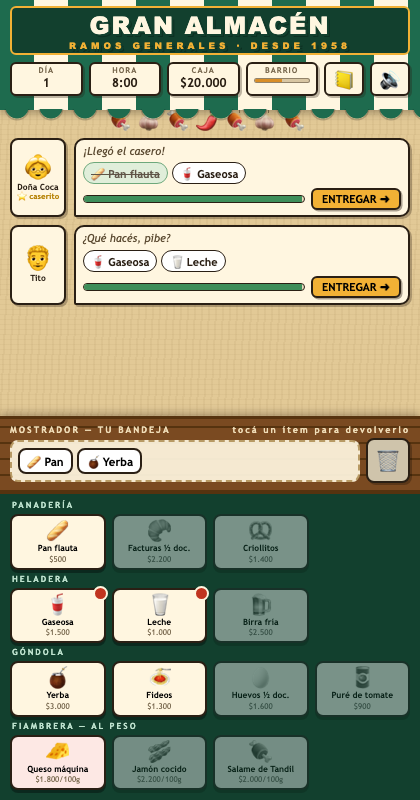
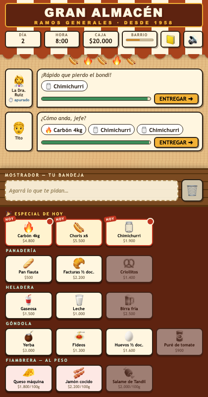
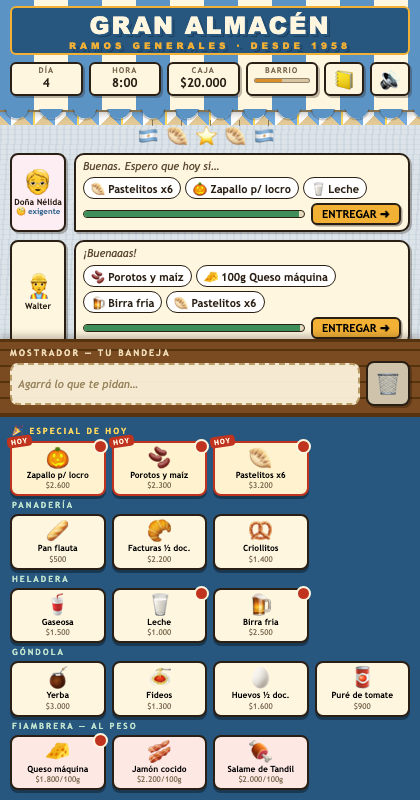
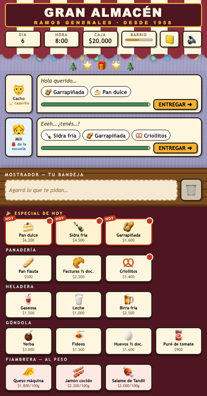
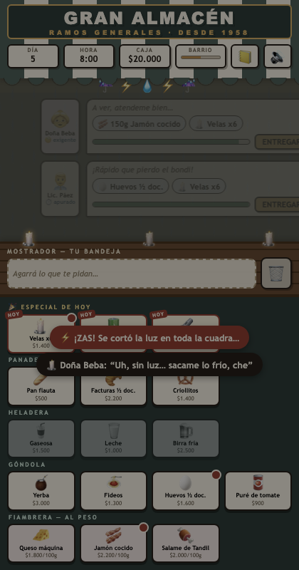

<div align="center">

# 🏪 GRAN ALMACÉN

**Ramos generales · desde 1958**

*Una semana al frente del almacén de barrio: cortá el fiambre al gramo, anotá el fiado en la libreta
y aguantá el mostrador mientras el almanaque te tira encima un asado, un locro patrio, una sudestada y la Nochebuena.*

[](https://nadimest.github.io/gran-almacen/)

[](https://github.com/nadimest/gran-almacen/actions/workflows/test.yml)


[](LICENSE)



</div>

---

Inspirado en **Overcooked** (servicio a contrarreloj), **Theme Hospital** (gestión y resúmenes de fin de día)
y el almacén de mi familia. No hay sprites, no hay mp3, no hay `node_modules` en producción:
cada gráfico es CSS y emoji, y cada sonido —desde la cumbia hasta el trueno de la sudestada—
se sintetiza en Web Audio en el momento.

## 🛎️ Cómo se juega

- 🛒 **El mostrador** — los vecinos llegan con pedidos y una barra de paciencia que no perdona.
  Juntá lo que piden de las góndolas y tocá **ENTREGAR** antes de que se vayan murmurando.
- 🔪 **La cortadora** — el fiambre va al peso: mantené apretado y soltá en el gramo justo.
  Zona dorada = corte de almacenero viejo = propina. Pasarse = "esto no se puede envolver".
- 📒 **La libreta** — los caseritos ⭐ piden fiado. Anotarlos sube tu fama y cobrás con propina
  el día de cobro… si llegás. Negarte es plata ya, pero el barrio murmura.
- 📰 **El diario del barrio** — cada noche, un titular sobre tu jornada y el alquiler que vence.
  Te fundís o tu fama llega a cero → se baja la persiana para siempre.

## 📅 La semana (acá el almanaque corre rápido)

| Día | En el barrio | En los parlantes |
|:---:|---|---|
| 1 | Apertura tranquila, conocé a los vecinos | Cumbia |
| 2 | 🔥 **1° de Mayo** — la cuadra entera prende la parrilla | Cuarteto (tunga-tunga) |
| 3 | 📒 Primer día de cobro de la libreta | Cumbia |
| 4 | 🇦🇷 **25 de Mayo** — locro, escarapelas y doñas exigentes | Chacarera en 6/8 con bombo legüero |
| 5 | 🌧️ **Sudestada** — se corta la luz, la heladera a oscuras, velas para todos | Milonga triste bajo la lluvia |
| 6 | 🎄 **Nochebuena** — pan dulce a último momento, 40 grados | Cumbia con campanitas |
| 7 | 🏆 Último día: todo o nada | Cumbia |

Cada evento repinta el almacén entero: paleta propia, guirnalda propia, clientela propia y género musical propio.

| 🔥 Asado del 1° de Mayo | 🇦🇷 Locro patrio |
|:---:|:---:|
|  |  |

| 🎄 Nochebuena | ⚡ El apagón de la sudestada |
|:---:|:---:|
|  |  |

## 👥 Los vecinos

| | Vecino | Maña |
|:---:|---|---|
| 🎒 | **El pibe de la escuela** | Lo mandó la mamá y se olvida: te cambia el pedido a mitad de espera (hasta dos veces) |
| 🧐 | **La doña exigente** | Rechaza cualquier corte que no sea al gramo — "mi finado Osvaldo lo cortaba mejor" — pero paga un 10% extra |
| ⏱️ | **El apurado** | Pierde el bondi: paciencia por el piso, propina del 25% si volás |
| ⭐ | **El caserito** | El de siempre. Pide fiado, te llena la libreta y te hace la fama |

## ⚙️ Bajo el capó

El gancho técnico del proyecto es la restricción: **cero dependencias en runtime, cero assets, cero build step para desarrollar.**

- **Música por género, sintetizada nota a nota** — sin un solo sample: el acordeón son tres
  sierras desafinadas con vibrato tardío, el cencerro es la receta del cowbell de la 808 (dos
  cuadradas por un pasabanda), el bombo legüero una senoidal de 70 Hz con caída, y hasta la
  reverb es un impulso de ruido generado al vuelo para el `ConvolverNode`. Cada tema corre en
  dos fases (acompañamiento → melodía) con repiques de timbal cerrando cada frase.
  Cinco géneros (`cumbia`, `cuarteto`, `chacarera`, `navidad`, `tormenta`) en [`js/audio.js`](js/audio.js).
- **Todo el estado del juego vive en un solo objeto** `G` ([`js/state.js`](js/state.js)); la UI es render puro
  sin listeners ([`js/ui.js`](js/ui.js)) y tres listeners delegados cablean todos los clicks ([`js/main.js`](js/main.js)).
- **Un build de un archivo** — [`tools/build_standalone.py`](tools/build_standalone.py) inlinea el CSS y concatena
  los módulos en un `dist/index.html` autocontenido que podés mandar por WhatsApp.
- **Mini-juego de la cortadora** ([docs/cortadora.png](docs/cortadora.png)) y **transición de persiana metálica**
  entre días ([docs/persiana.png](docs/persiana.png)), también puro CSS.

```
index.html              shell del DOM
css/styles.css          estilos: persiana, kraft, paletas y decorado por evento
js/
  helpers.js            utilidades puras
  data.js               catálogo, calendario festivo, arquetipos, diálogos
  audio.js              secuenciador Web Audio (5 géneros) + SFX sintetizados
  state.js              contenedor de estado G + consultas puras
  storage.js            mejor racha persistente (localStorage)
  ui.js                 render puro del DOM (delegación por data-*)
  game.js               lógica: días, vecinos, entrega, fiado, cortadora, apagón
  main.js               cableado de eventos y arranque
tools/
  build_standalone.py   genera dist/index.html (un solo archivo)
  smoke_test.mjs        suite de integración en jsdom (17 chequeos de click real)
```

## 🛠️ Desarrollo

```bash
python3 -m http.server 8000          # jugar en http://localhost:8000 (módulos ES)
npm install && npm test              # build + suite de humo en jsdom
python3 tools/build_standalone.py    # → dist/index.html, un solo archivo
```

Los tests bootean el bundle real en jsdom y juegan de verdad: clickean góndolas, entregan pedidos,
aceptan fiados, rechazan cortes mal pesados y provocan el apagón. Corren en CI en cada push.

## 📜 Licencia

[MIT](LICENSE). La nostalgia es de dominio público.

<div align="center">

**[▶ Subir la persiana](https://nadimest.github.io/gran-almacen/)** 🧉

</div>
